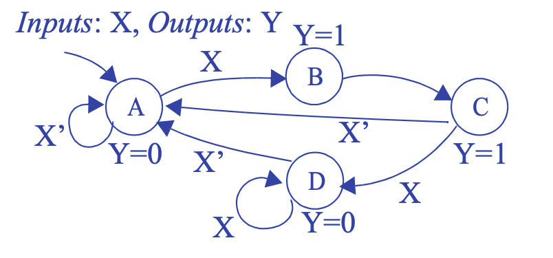
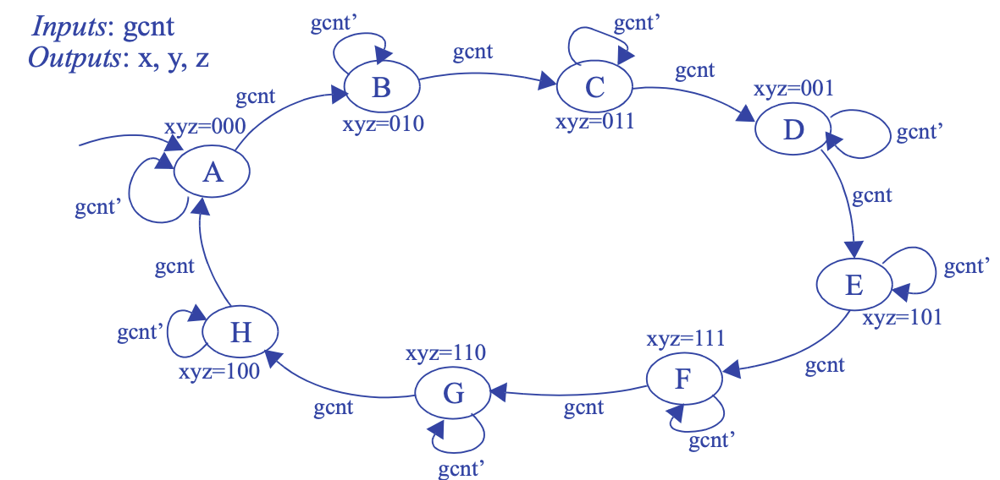
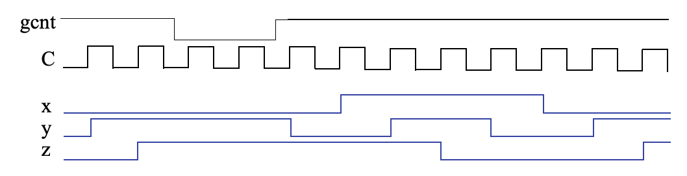
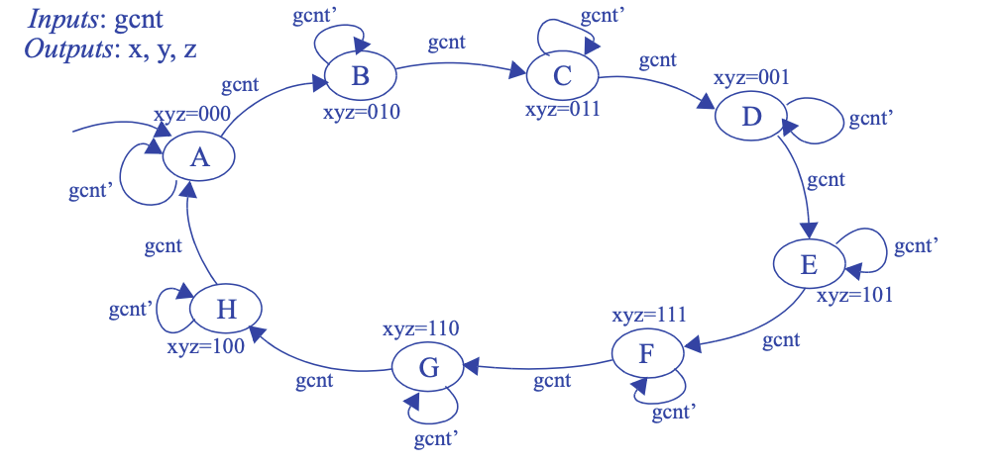
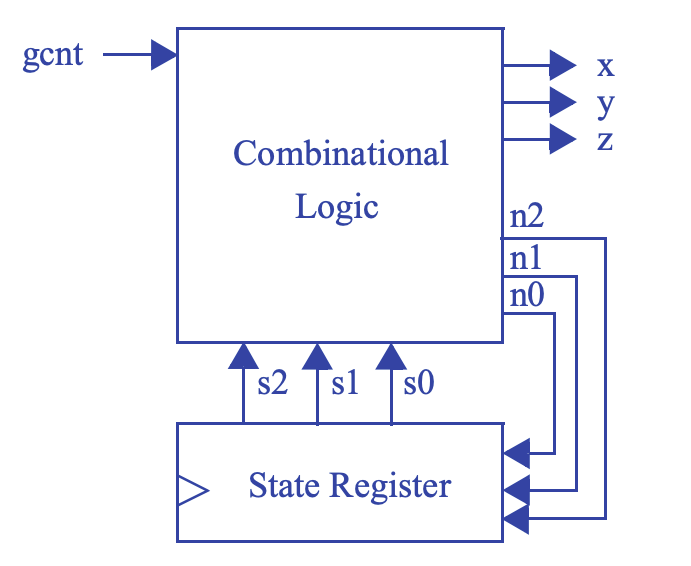
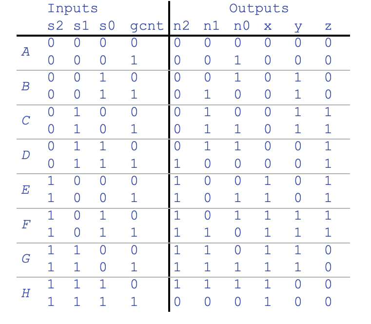
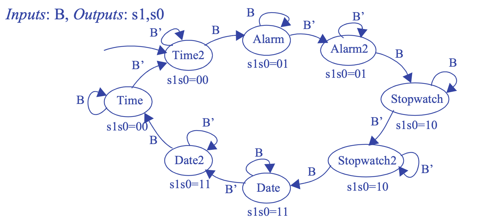
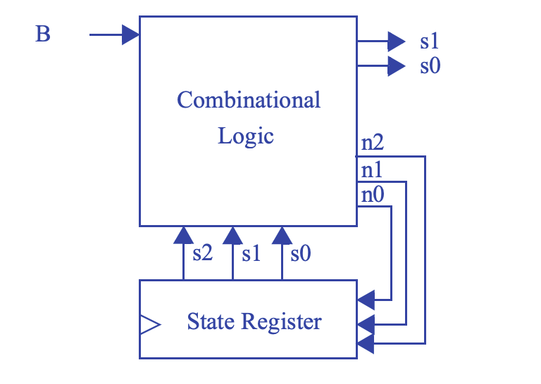
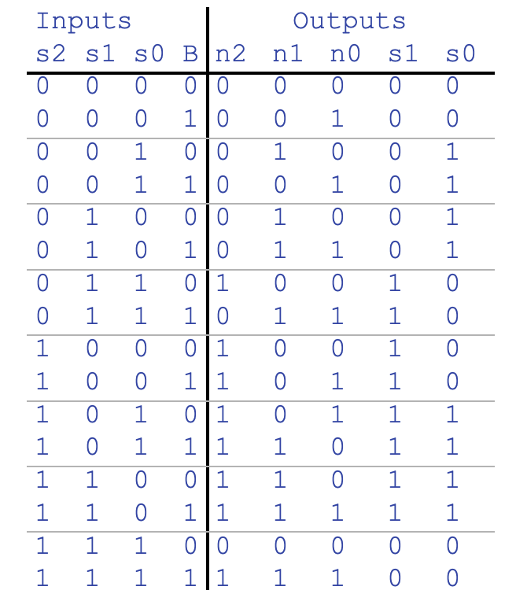

# Problem numbr X
In the report, complete the following.
- Explain the objective of the problem.
- Give your solution.
- Include all your project codes in the [codes/assg](../../codes/assg) folder,
  if required.
- Explain your code snippets, if required.
- Include screenshots of the simulations in this folder, and insert them into
  the markdown file, if required.
- Explain why the simulations are correct, if required.

## (5 pts)
Draw a state diagram for an FSM that has an input X and an output Y. Whenever X changes from 0 to 1, Y should become 1 for two clock cycles and then return to 0 -- even if X is still 1. (Assume for this problem and all other FSM problems that an implicit rising clock is ANDed with every FSM transition condition.)

> 

## (5 pts)
Draw a state diagram for an FSM with an input gcnt and three outputs, x, y and z. The xyz outputs generate a sequence called a Gray code in which exactly one of the three outputs changes from 0 to 1 or from 1 to 0. The Gray code sequence that the FSM should output is 000, 010, 011, 001, 101, 111, 110, 100, repeat. The output should change only on a rising clock edge when the input gcnt = 1. Make the initial state 000.

> 

## (5 pts)
Trace through the execution of the FSM created in Exercise above by completing the timing diagram in Figure below, where C is the clock input. Assume the initial state is the state that sets xyz to 000.

> 

## (5 pts)
Using the process for designing a controller, convert the FSM you created for Exercise above to a controller, implementing the controller using a state register and logic gates.

> Step 1 - Capture the FSM  
>   
> Step 2A - Set up the architecture  
>   
> Step 2B - Encode the states  
> A straightforward encoding is A=000, B=001, C=010, D=011, E=100, F=101, G=110, H=111.  
> Step 2C - Fill in the truth table  
>   
> Step 2D - Implement the combinational logic  
> n2 = s2’s1s0gcnt + s2s1’ + s2s1s0’ + s2s1s0gcnt’  
> n1 = s2’s1’s0gcnt + s2’s1s0’ + s2’s1s0gcnt’ + s2s1’s0gcnt + s2s1s0’ + s2s1s0gcnt’  
> n0 = s2’s1’s0’gcnt + s2’s1’s0gcnt’ + s2’s1s0’gcnt + s2’s1s0gcnt’ + s2s1’s0’gcnt + s2s1’s0gcnt’ + s2s1s0’gcnt + s2s1s0gcnt’  
> x = s2  
> y = s2’s1’s0 + s2’s1s0’ + s2s1’s0 + s2s1s0’  
> z = s2’s1 + s2s1’  
> Note: The above equations can be minimized further  

## (5 pts)
A wristwatch display can show one of four items: the time, the alarm, the stopwatch, or the date, controlled by two signals s1 and s0 (00 displays the time, 01 the alarm, 10 the stopwatch, and 11 the date—assume s1s0 control an N-bit mux that passes through the appropriate register). Pressing a button B (which sets B = 1) sequences the display to the next item. For example, if the presently displayed item is the date, the next item is the current time. Create a state diagram for an FSM describing this sequencing behavior, having an input bit B, and two output bits s1 and s0. Be sure to only sequence forward by one item each time the button is pressed, regardless of how long the button is pressed—in other words, be sure to wait for the button to be released after sequencing forward one item. Use short but descriptive names for each state. Make displaying the time be the initial state.

## (5 pts)
Using the process for designing a controller, convert the FSM you created for Exercise above to a controller, implementing the controller using a state register and logic gates

> Step 1 - Capture the FSM  
>   
> Step 2A - Set up the architecture  
>   
> Step 2B - Encode the states  
> A straightforward encoding is Time2=000, Alarm=001, Alarm2=010, Stopwatch=011, Stopwatch2=100, Date=101, Date2=110, Time=111.  
> Step 2C - Fill in the truth table  
>   
> Step 2D - Implement the combinational logic  
> n2 = s2’s1s0B’ + s2s1’ + s2s0’ + s2B  
> n1 = s1s0’ + s1B + s2s0B + s2’s1’s0B’  
> n0 = s0’B + s2’B + s1B + s2s1’s0B’  
> s1 = s2s0’ + s2s1’ + s2’s1s0  
> s0 = s1 XOR s0  
